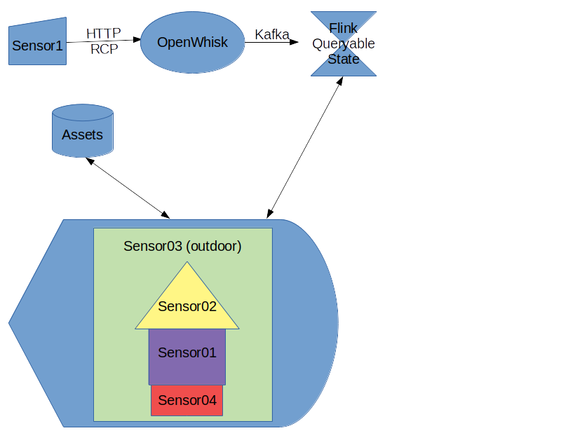

# Ibeji - An Apache Based Digital Twin Solution

### Must Haves

The following are minimum requirements for this platform.

- [ ] Access control policies- not everyone is entitled to all information
- [ ] Persistent assets which can be updated be real world sensor data in near-real time.
- [ ] At the level this is presented to the user- there will also be various tech manuals available that are also 
presented. 
- [ ] Ability to search for assets. 
- [ ] User can upload CAD file of an asset, assign where sensors should display on the 
asset, and when data is hooked up it will yeild pretty pictures. See [asset-design](asset-design/README.md) for more info.


### Architecture

#### Option 1:

Sensor -> OpenWhisk -> Kafka -> Flink -> Queryable State of Sensors



In this setup the asset has information like so:
```json
{
	"asset name" : "MyHouse1",
	"CAD" : ... # all the info on how to render
	"sensors" : {
		"sensor01" : {
				"location" : [0, 0, 37] # relative to CAD
				"queryKey" : "myhouse1sensor1",
				"renderInfo" : {
					"series1" : { "value" : [0,100], "gradient" : "PurpleOrange" }
				}
		"sensor02" : ...
		
		}
	},
	"otherData" : {
		"ownersManuals" : {
			"furnace" : "Carrier Model 0315.pdf"
			"lawnMover" : "Toro Blade Killer.pdf"
			"garageDoorOpener" : "Gennie Up Down 105 Series"
			...
		}
	},
	"maintainanceHistory" :
		[("June 1st, 2004", "House built"),
		 ("October 22nd, 2011", "Lawn Mowed"), 
		 ...]
}
```

When the page is loaded- the asset above is pulled up.  Notice the `queryKey`. For each sensor then, we query flink's 
queryable state- something like. 

```SQL
SELECT myhouse1sensor1,
myhouse1sensor2,
myhouse1sensor3,
myhouse1sensor4
FROM flinkQS
WINDOW sliding AVERAGE BY 30 second
``` 

Which in some very dirty streaming SQL says give me these 4 sensors (specified in the asset definition), and would
return something like 

```json
{ 
	"myhouse1sensor1" : 12,
	"myhouse1sensor2" : "leak detected",
	"myhouse1sensor3" : 73.3,
	"myhouse1sensor4" : false
}
```

And then also in the asset defintion it dictates how to display all of those values.  

### Name

The [Ibeji Twins](https://en.wikipedia.org/wiki/Ibeji) from Afro-Carribean Cosmology, are the twins of joy and happiness.
